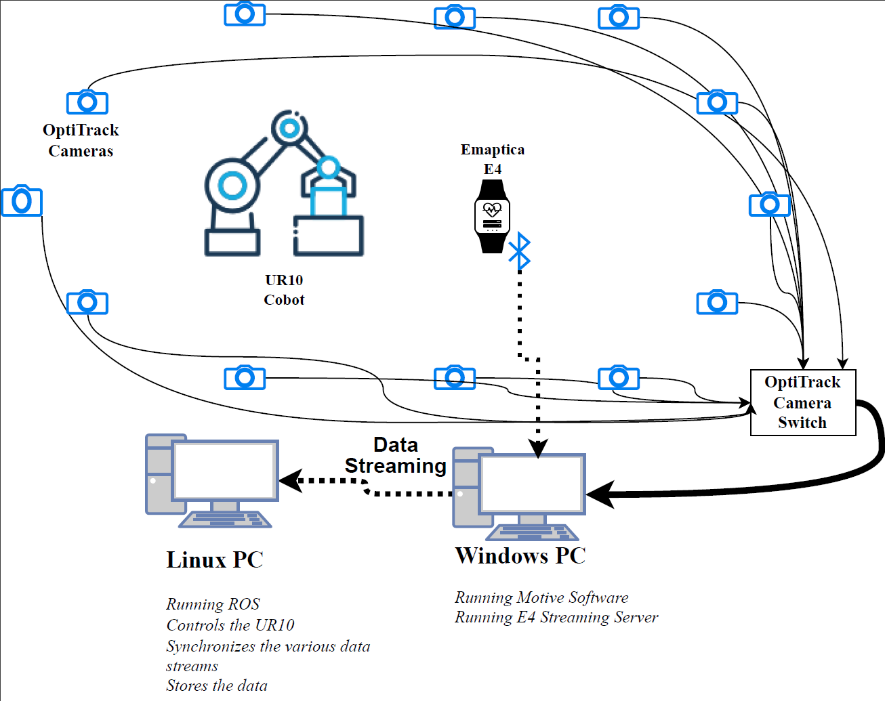

Sensors Used:
Empatica E4 wristwatch measures BVP, EDA, Skin temperature and Acceleration.
OptiTrack Motion Capture data to measure body motion data.

The Mocap send the motion data to the tf topic. 

Docker Image for running the E4 Empatica Node. Docker runs Ubuntu 20.04 with both ROS1(Noetic) and ROS2(Foxy) installed and also a ROS1 bridge and the E4 package. 
The setup is shown below:

Pull the docker file from DockerHub and run it. The running of the E4 node and ROS-Bridge is explained in the [data collection process section]()

`docker pull mdfaiz98/custome4:v4`  
`docker run  mdfaiz98/custome4:v5`  
`docker exec -it mdfaiz98/custome4:v5 bash`

The whole setup is as follow 

Place [e4_msgs](./e4_msgs/) folder , [sync_data_sub](./sync_data_sub/) as well as robot_utilities, ur10, ur_cobra , ur10_task planner in your workspace. The first two should have it own branch mf_stress_estimation. The [ros2-empatica_e4](./ros2-empatica_e4/) is for the ros2 node, it should already be built in the docker container.