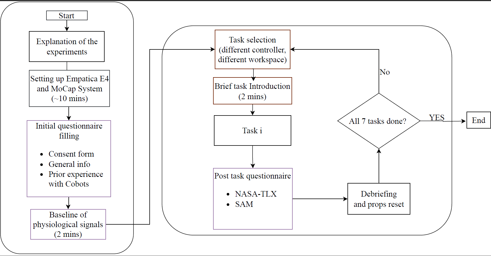

Master Sequence with Info contains the task and placement position of the items for each task.
Sequence 1 contains the one example task instruction given to a participant in a particular sequence.
The naming of the task is given in the brackets below:


The task Config folder contains the task configuration files for the task planner. 

## Data Collection Process 


For the Data collection process, 
 ## Start ROS Core
* Terminal 1 
```
roscore
```

## Initialize Docker and Start Empatica E4 Data Collection
* Terminal 2

```
newgrp docker
docker start a7f6e123921e
docker exec -it a7f6e123921e bash
foxy 
e4
ros2 launch empatica_e4 ros2-empatica_E4.launch.py
```
## Setup ROS1 Bridge for ROS2 inside Docker
* Terminal 3
```
newgrp docker
docker start a7f6e123921e
docker exec -it a7f6e123921e bash
ros1
foxy
bridge
ros2 run ros1_bridge dynamic_bridge --bridge-all-2to1-topics
```
## Run Synchronization Script
Terminal 4
```
rosrun sync_data_sub sync_sub.py
```
## Launch UR Visualization Launch File
Terminal 5

ur10_real_visualization_obstacle.launch(FOR AX,BX,CX-humans:=nohuman.yaml, For Others- humans:=myhuman.yaml)

Generally: 
`roslaunch ur_launch ur10_real_visualization_obstacle.launch` 

But use the Experiment specific launch files

For AX;BX and CX:
`roslaunch ur_launch ur10_real_visAXBXCX.launch`

For BY and CY:
`roslaunch ur_launch ur10_real_visBYCY.launch`

For BZ and CZ:
`roslaunch ur_launch ur10_real_visBZCZ.launch`

## Launch UR Cobra Launch File
Terminal 6

`roslaunch ur_cobra ur10_cobra.launch                        bringup_scenario.launch`

(For AX,BX,CX,BY,CY)prediction_mode:=None and "uncertainty_mode:=None
                                                                                 (For BZ,CZ)- prediction_mode:=Polynom and "uncertainty_mode:=GMM

## Launch Task Planner
Terminal 7

`roslaunch ur_task_planner ur10_real_task_planner.launch`         
Task config files in [TaskConfig](./Task%20Config/)
 
##  Record ROS Bags for Real Participants
Termianl 8

( Make folder with participant id and save there)

`cd ~/catkin_ws/src/rosbags/real_participants`
 
`rosbag record /aggregated_data /tf /ur_driver/joint_states `     


